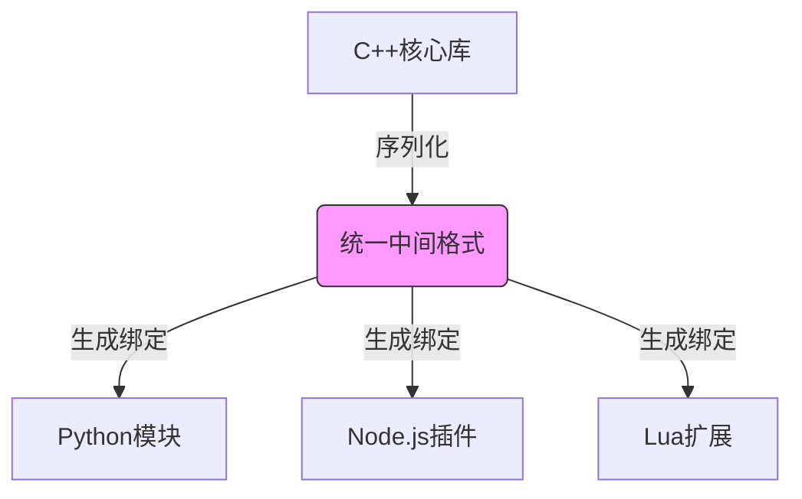

# dmmeta - 跨语言数据中间件集合

[](LICENSE)
[](https://github.com/brinkqiang/dmmeta/actions)

dmmeta 是一个专注于解决多语言数据交互难题的中间件集合，提供高效可靠的数据格式转换和跨语言通信解决方案。

## 特性

- 🚀 核心语言：C++，绑定支持：Python/JavaScript/Lua
- 🔄 自动类型映射系统（支持基础/复合数据类型）
- ⚡ 高性能二进制协议（基于protobuf:idl）
- 🛡️ 数据校验与版本兼容性支持
- 📦 零依赖核心库（各语言实现保持独立）
- 🧨 支持与其他格式互相转换
- 🔑 支持ORM映射
## 快速开始

### 安装
```bash
# Python
pip install dmmeta

# JavaScript
npm install dmmeta

# Lua
luarocks install dmmeta
```

### 基础用法


## 架构设计



## 高级功能

### 类型映射表（基于C++ STL）
| C++类型               | 中间类型 (STL容器)        | Python绑定        | JS绑定           | Lua绑定          |
|-----------------------|--------------------------|-------------------|-----------------|------------------|
| 基础类型              |                          |                   |                  |                  |
| bool                  | bool                     | bool              | boolean         | boolean          |
| int32_t               | int32                    | int               | number          | number           |
| double                | double                   | float             | number          | number           |
| string                | string                   | str               | String          | string           |
| 容器类型              |                          |                   |                  |                  |
| vector<T>            | vector<T>                | List[Type]       | Array           | table (array)    |
| unordered_map<K,V>    | unordered_map<K,V>       | Dict[Key,Value]  | Map             | table (hash)     |
| 复合类型              |                          |                   |                  |                  |
| 自定义结构体           | pod_struct               | @dataclass        | Class           | userdata         |

### 性能对比
格式 | Python序列化 | JS序列化 | Lua序列化 | 数据压缩比
-----|-------------|------------|-----------|-----------

## 开发指南

### 编译协议文件
```bash
# 生成多语言绑定
dmmeta generate --schema user.proto --output cpp,py,js,lua
```

### 贡献代码
欢迎提交PR并遵循以下流程：
1. Fork仓库
2. 创建特性分支（`git checkout -b feature/amazing-feature`）
3. 提交更改（`git commit -m 'Add amazing feature'`）
4. 推送到分支（`git push origin feature/amazing-feature`）
5. 创建Pull Request

## 授权协议
本项目采用 [MIT 许可证](LICENSE)
